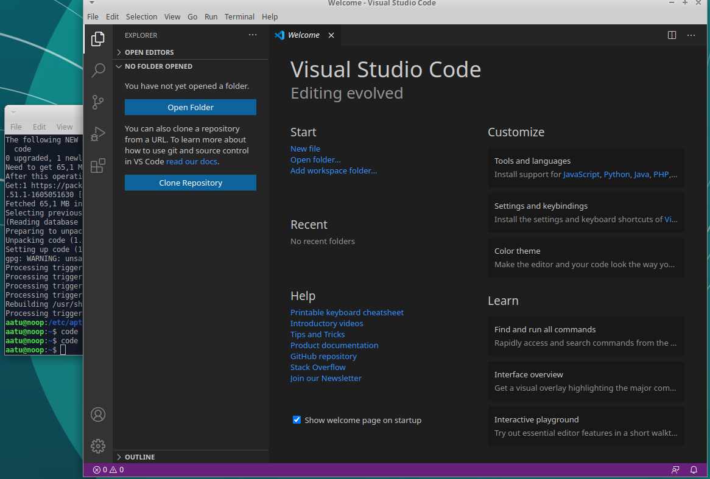
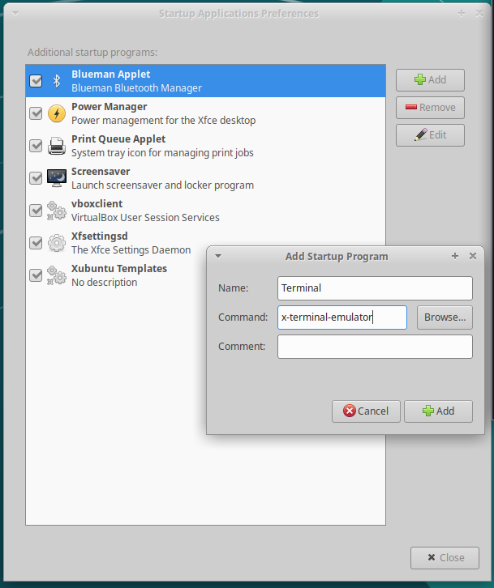
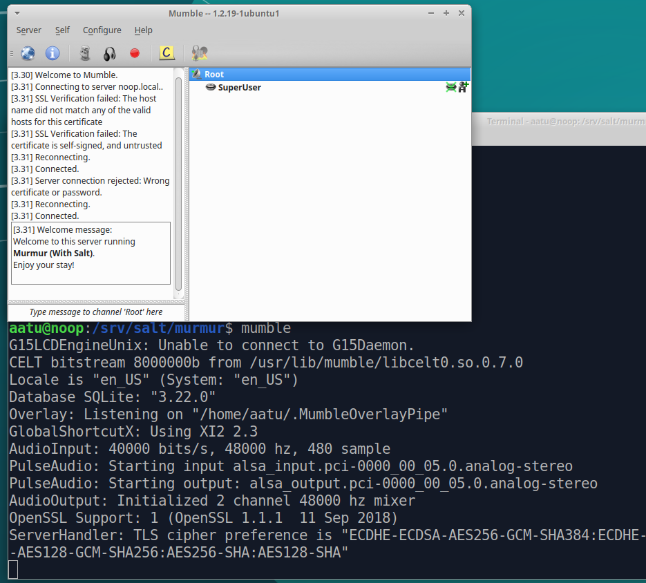

# muistiinpano    

  ----
/etc/apt/trusted.gpg.d/microsoft.gpg:
  file.managed:
    - source: salt://vscode/microsoft.gpg

/etc/apt/sources.list.d/microsoft.list:
  file.managed:
    - source: salt://vscode/microsoft.list

code:
  pkg.installed:
    - refresh: True
  ----
    
    
   xubuntu@xubuntu:/srv/salt/webtest$ history
   1  setxkbmap fi
   2  sudo apt-get update
   3  sudo apt-get -y install salt-master
   4  hostname -I   
   5  sudo apt-get update
   6  sudo apt-get -y install salt-minion
   7  sudoedit /etc/salt/minion
   8  sudo systemctl restart salt-minion.service
   9  sudo salt-key -A
   10  sudo salt 
cmd.run
 'whoami'
   11  sudo salt '*' 
cmd.run
 'whoami'
   12  history
   13  sudo apt-get installchromium browser
   14  sudo apt-get install chromium browser
   15  sudo apt-get install chromium-browser
   16  wget 
https://packages.microsoft.com/keys/microsoft.asc

   17  less microsoft.asc 
   18  man apt-key
   19  sudo apt-key add microsoft.asc 
   20  ls /etc/apt/trusted.gpg.d
   21  cd /etc/
   22  ls
   23  find
   24  find -printf '%p'
   25  find -printf '%p\n'
   26  find -printf '%+T%p\n'
   27  find -printf '%+T+%p\n'
   28  find -printf '%T+ %p\n'
   29  find -printf '%T+ %p\n'|sort
   30  less /etc/apt/trusted.gpg
   31  cd /etc/apt/trusted.gpg.d/
   32  ls
   33  less ubuntu-keyring-2012-archive.gpg 
   34  cd
   35  sudo add-apt-repository "deb 
https://packages.microsoft.com/repos/vscode
 stable main"
   36  apt-cache show
   37  apt-cache show code
   38  cd /etc/apt/
   39  cd ..
   40  ls
   41  find -printf '%T+ %p\n'|sort
   42  less /etc/apt/sources.list
   43  less /etc/apt/sources.list.d
   44  cd /etc/apt/sources.list.d
   45  ls
   46  sudo apt-get update
   47  sudoedit microsoft.list
   48  less /etc/apt/sources.list
   49  sudoedit /etc/apt/sources.list
   50  sudo apt-get update
   51  sudoedit microsoft.list
   52  sudoedit /etc/apt/sources.list
   53  sudoedit microsoft.list
   54  sudo apt-get update
   55  cat microsoft.list 
   56  sudoedit /etc/apt/sources.list
   57  apt-key list
   58  sudo apt-key del 
gpgsecurity@microsoft.com

   59  apt-key list
   60  sudo apt-key del 'BC52 8686 B50D 79E3 39D3  721C EB3E 94AD BE12 29CF'
   61  apt-key list
   62  cd
   63  ls
   64  sudo apt-key add --keyring /etc/apt/trusted.gpg.d/microsoft.gpg microsoft.asc
   65  ls /etc/apt/trusted.gpg.d/
   66  sudo apt-key --keyring /etc/apt/trusted.gpg.d/microsoft.gpg add -
   67  sudo apt-key --keyring /etc/apt/trusted.gpg.d/microsoft.gpg add microsoft.asc
   68  apt-key list
   69  sudo apt-get update
   70  
   71  code
   72  history
   73* 
   74  sudo mkdir -p /srv/salt/
   75  sudoedit /srv/salt/hello.sls
   76  cd /srv/salt
   77  ls
   78  mkdir hello
   79  sudo mkdir hello
   80  cp hello.sls hello
   81* 
   82  sudo mv hello.sls hello/
   83  cd hello
   84  ls
   85  sudo mv hello.sls init.sls
   86  ls
   87  sudoedit hello.txt
   88* 
   89  sudoedit /srv/salt/init.sls
   90  ls
   91  sudoedit init.sls
   92  sudo salt '*' state.apply hello
   93  cd /tmp/
   94  ls
   95  less hello.txt 
   96  cd /srv/salt
   97  mkdir vscode
   98  sudo mkdir vscode
   99  cd vscode
  100  ls
  101  ls /etc/apt
  102  sudo apt-get install tree
  103  tree /etc/apt
  104  cat /etc/apt/sources.list.d/microsoft.list 
  105  cat /etc/apt/sources.list.d/vscode.list 
  106  sudo cp /etc/apt/sources.list.d/microsoft.list. 
  107  sudo cp /etc/apt/sources.list.d/microsoft.list .
  108  ls
  109  tree /etc/apt|less
  110  sudo cp /etc/apt/trusted.gpg.d/microsoft.gpg .
  111  ls
  112  ls /etc/apt/sources.list.d/microsoft.list 
  113  ls /etc/apt/sources.list.d/microsoft.list /etc/apt/sources.list.d/vscode.list 
  114  ls /etc/apt/sources.list.d/microsoft.list  /etc/apt/trusted.gpg.d/ 
  115  ls /etc/apt/sources.list.d/microsoft.list  /etc/apt/trusted.gpg.d/microsoft.gpg
  116  ls
  117  sudoedit init.sls
  118  sudo salt '*' state.apply vscode
  119  sudo rm /etc/apt/trusted.gpg.d/microsoft.gpg
  120  sudo salt '*' state.apply vscode
  121  sudoedit init.sls
  122  sudo salt '*' state.apply vscode
  123  sudo salt '*' sys.state_doc pkg
  124  sudo salt '*' sys.state_doc pkg|less
  125  sudoedit init.sls
  126  sudo salt '*' state.apply vscode
  127  cat init.sls
  128  sudoedit init.sls
  129  cat init.sls
  130  apt-key list
  131  sudo apt-key del 'BC52 8686 B50D 79E3 39D3  721C EB3E 94AD BE12 29CF'
  132  apt-key list
  133  sudo rm /etc/apt/trusted.gpg.d/microsoft.gpg~ 
  134  ls -a /etc/apt/trusted.gpg.d/
  135  cat init.sls
  136  cd /etc/apt/sources.list.d/
  137  ls
  138  ls -a
  139  sudo rm microsoft.list 
  140  sudo rm vscode.list 
  141  ls -a
  142  sudo apt-get purge code
  143  code
  144  apt-cache show code
  145  sudo apt-get update
  146  sudo salt '*' state.apply vscode
  147  code
  148  sudo salt '*' state.apply vscode
  149  cat init.sls
  150  cd /srv/salt
  151  ls
  152  cd vscode
  153  ls
  154  cat init.sls
  155  history
  156  cat init.sls
  157  find -printf '%T+ %p\n'|sort
  158  cd ..
  159  mkdir webtest
  160  sudo mkdir webtest
  161  cd webtest
  162  sudoedit init.sls
  163  sudo salt '*' state.apply webtest
  164  history
    
# 10 ohjelman asennus tila

  $ cd /srv/salt
  $ sudo mkdir obvious
  $ cd obvious/
  $ sudoedit init.sls

    obvious:
      pkg.installed:
        - pkgs:
          - synaptic
          - vlc
          - gimp
          - clementine
          - mumble
          - unity-tweak-tool
          - audacity
          - neofetch
          - shutter
          - vim          

    $ sudo salt-call --local -l debug state.apply obvious
Paketit asentuivat, joten päätin testata ohjelmia ihan vain avaamalla ne.

    $ clementine
    $ audacity
    $ shutter
    $ mumble
    $ gimp
    $ vlc
    $ synaptic
    $ vim
    $ unity-tweak-tool
    $ neofetch
                  .-/+oossssoo+/-.               aatu@noop 
              `:+ssssssssssssssssss+:`           --------- 
            -+ssssssssssssssssssyyssss+-         OS: Ubuntu 18.04.5 LTS x86_64 
          .ossssssssssssssssssdMMMNysssso.       Host: VirtualBox 1.2 
         /ssssssssssshdmmNNmmyNMMMMhssssss/      Kernel: 5.4.0-53-generic 
        +ssssssssshmydMMMMMMMNddddyssssssss+     Uptime: 4 hours, 6 mins 
       /sssssssshNMMMyhhyyyyhmNMMMNhssssssss/    Packages: 2127 
      .ssssssssdMMMNhsssssssssshNMMMdssssssss.   Shell: bash 4.4.20 
      +sssshhhyNMMNyssssssssssssyNMMMysssssss+   Resolution: 1920x975 
      ossyNMMMNyMMhsssssssssssssshmmmhssssssso   DE: Xfce 
      ossyNMMMNyMMhsssssssssssssshmmmhssssssso   WM: Xfwm4 
      +sssshhhyNMMNyssssssssssssyNMMMysssssss+   WM Theme: Greybird 
      .ssssssssdMMMNhsssssssssshNMMMdssssssss.   Theme: Greybird [GTK2/3] 
       /sssssssshNMMMyhhyyyyhdNMMMNhssssssss/    Icons: Elementary-xfce-darker [GTK2/ 
        +sssssssssdmydMMMMMMMMddddyssssssss+     Terminal: xfce4-terminal 
         /ssssssssssshdmNNNNmyNMMMMhssssss/      Terminal Font: DejaVu Sans Mono 9 
          .ossssssssssssssssssdMMMNysssso.       CPU: Intel i7-7700K (1) @ 4.200GHz 
            -+sssssssssssssssssyyyssss+-         GPU: VMware SVGA II Adapter 
              `:+ssssssssssssssssss+:`           Memory: 876MiB / 3936MiB 
                  .-/+oossssoo+/-. 
                                                                   

kaikki ohjelmat toimivat!

# VSCode
Latasin netistä vscode gpg keyn

    $ wget https://packages.microsoft.com/keys/microsoft.asc
Ja lisäsin sen trusted gpg kansioon.

    $ sudo mv microsoft.asc /etc/apt/trusted.gpg.d/
    $ sudo apt-key add microsoft.asc
lisäsin vscode apt-repositoryn 

    $ sudo sudo add-apt-repository "deb https://packages.microsoft.com/repos/vscode stable main"
Ja päivitin apt ja asensin uusimmat versiot ohjelmista

    $ sudo apt-get update; sudo apt-get dist-upgrade
Sitten vain asensin vscoden
    
    $ sudo apt-get install code
Ja testasin toimiiko
    
    $ code
toimii.

# CSI Pasila

    cd /etc/; sudo find -printf '%T+ %p\n'|sort|tail
    2020-11-24+20:52:12.4041635700 ./ld.so.cache
    2020-11-24+20:52:18.1750475740 ./apt/apt.conf.d
    2020-11-24+20:52:18.1750475740 ./apt/apt.conf.d/01autoremove-kernels
    2020-11-24+20:52:56.1620315680 ./depmod.d/vboxvideo-upstream.conf
    2020-11-24+20:56:33.9908917120 ./apt/sources.list.d
    2020-11-24+20:56:33.9908917120 ./apt/sources.list.d/vscode.list
    2020-11-24+20:56:33.9908917120 ./apt/trusted.gpg.d
    2020-11-24+20:56:33.9908917120 ./apt/trusted.gpg.d/microsoft.gpg
    2020-11-24+20:56:34.1629777120 .
    2020-11-24+20:56:34.1629777120 ./mailcap

Komento cd /etc/ vie hakemistoon /etc/, komento find etsii hakemistosta: -prinft on tulostetun stringin formaatti. Direktiivissä "%T+", %T kertoo tiedostojen viimeisen muutos ajan ja "+" kertoo millä tyylillä aika kerrotaan, tässä tapauksessa + merkitsee aikamäärää ja kellonaikaa jotka on tulosteessa erotettu + merkillä. %p on tiedoston nimi, \n on rivinvaihto. Stringi pipetaan |sort aakkosjärjestykseen, tai tässä tapauksessa vanhimmasta muutoksesta uusimpaan, ja |tail näyttää vain "loppuosan" löydöksistä, eli 10 viimeisintä muutettua tiedostoa. 

lähde: 
    
    man find

Halusin terminaalin avautuvan suoraan kun avaan xubuntun. 

Lisäsin "x-terminal-emulator" startup applicationseihin. 

ja käytin findiä etsiäkseni mitä tiedostoja on muuttunut. 

    $ cd ; sudo find -printf '%T+ %p\n'|sort|tail
    2020-11-25+00:40:04.3896954170 ./.config/yelp/yelp.cfg
    2020-11-25+00:45:29.1736953900 ./.config/xfce4-session
    2020-11-25+00:47:58.7816953780 ./.xsession-errors
    2020-11-25+00:48:58.9976953730 ./.config/xfce4
    2020-11-25+00:48:58.9976953730 ./.config/xfce4/help.rc
    2020-11-25+00:52:40.6176953550 ./.config
    2020-11-25+00:52:40.6176953550 ./.config/autostart
    2020-11-25+00:52:40.6176953550 ./.config/autostart/x-terminal-emulator.desktop
    2020-11-25+00:52:45.4216953550 ./.local/share/recently-used.xbel
    2020-11-25+00:52:45.4256953550 ./.local/share
Lisäykseni oli luonut x-terminal-emulator.desktop tiedoston. Aikajana näyttää ./config/ ./config/autostart/ directoryihin tapahtuneen muutoksia samanaikaisesti uuden tiedoston luonnin kanssa, koska niiden sisällöissä tapahtui muutoksia (luotiin uusi tiedosto)
 
 x-terminal+emulator.desktop tiedoston sisältö:
 
      [Desktop Entry]
      Type=Application
      Exec=x-terminal-emulator
      Hidden=false
      NoDisplay=false
      X-GNOME-Autostart-enabled=true
      Name[en_US]=Terminal
      Name=Terminal
      Comment[en_US]=
      Comment=

# ohjelmaan muutos ja salt staten luonti
Päätin tehdä muutoksen jo aijemmin asennettuun clementine ohjelmaan, vaihtamalla shuffle moden "Shuffle all":iksi ja repeat moden "Repeat playlist":iksi.

sitten etsin muutetut tiedostot findillä
    
    $ sudo find -printf '%T+ %p\n'|sort|tail
    2020-11-25+01:18:52.0682067210 ./.config/xfce4/xfconf/xfce-perchannel-xml/xfce4-panel.xml
    2020-11-25+01:20:44.9242067120 ./.config/Clementine/clementine.db.bak
    2020-11-25+01:20:44.9282067120 ./.config/Clementine
    2020-11-25+01:20:59.7282067100 ./.xsession-errors
    2020-11-25+01:22:56.3722067010 ./.config
    2020-11-25+01:22:59.8082067010 ./.config/gtk-2.0/gtkfilechooser.ini
    2020-11-25+01:22:59.8122067010 ./.config/gtk-2.0
    2020-11-25+01:24:59.0682066910 ./.config/xfce4/xfconf/xfce-perchannel-xml
    2020-11-25+01:24:59.0682066910 ./.config/xfce4/xfconf/xfce-perchannel-xml/xfce4-notifyd.xml
    2020-11-25+01:27:02.3642066810 ./.config/Clementine/Clementine.conf

testasin muutoksia pari kertaa ja huomasin että ainoa tiedosto aikajanasta joka muuttui asetuksien vaihdosta oli ./.config/Clementine/Clementine.conf

conf tiedosto oli muuttunut kohdasta:

    [PlaylistSequence]
    shuffle_mode=1
    repeat_mode=3

Tein Clementinelle salt moduulin ja kopioin sinne Clementine.conf tiedoston. 

    $ cd /srv/salt/
    $ sudo mkdir Clementine
    $ cd
    $ sudo cp ./.config/Clementine/Clementine.conf /srv/salt/Clementine/.
Tarkistin että tiedoston kopiointi oli toiminut ja tiedosto on nyt oikeassa paikassa. 

    $ sudo cat /srv/salt/Clementine/Clementine.conf |tail
    group_by1=1
    group_by2=2
    group_by3=0
    
    [LibraryConfig]
    last_path=
    
    [PlaylistSequence]
    shuffle_mode=1
    repeat_mode=3

Sitten itse staten luonti

    $ cd /srv/salt/Clementine
    $ sudoedit init.sls
    
    Clementine:
      pkg.installed  
    //home/aatu/.config/Clementine/Clementine.conf:
      file.managed:
        - source: salt://Clementine/Clementine.conf

~/.config/Clementine/Clementine.conf: destination ei toiminut, mutta sain toimimaan absoluuttisella pathilla - tämä state toimii tietenkin vain kyseisellä koneella koska /aatu/ löytyy.

Toinen tapa miten tämän saa ehkä toimimaan muilla koneilla/käyttäjillä on valita destination folderiksi /etc/skel/

    $ sudoedit /srv/salt/Clementine/init.sls
    clementine:
      pkg.installed
    /etc/skel/.config/Clementine/Clementine.conf:
      file.managed:
        - source: /srv/salt/Clementine/Clementine.conf
        - makedirs: True

Nyt Clementine.conf pitäisi olla oikeassa paikassa kun uusi käyttäjä luodaan useradd komennolla.

Jätän tämän tähän, katsotaan jos löytäisin seuraavaksi ohjelman jossa conf tiedosto on vaikka /etc/ directoryssa.

# uusi salt state... - taas

Nyt päätin konffata mumble-server demonin.
aloitin ajamalla initial configurationin.

    $ sudo dpkg-reconfigure mumble-server
    $ sudo systemctl restart mumble-server  
ja asetin serverille yhdistämiseen tarvittavan salasanan.

    $ sudoedit /etc/mumble-server.ini
    serverpassword=Suola
    
Sitten loin salt moduulin ja kopioin sinne muokkaamani ini filen.

    $ cd /srv/salt
    $ sudo mkdir murmur
    $ cd murmur/
    $ sudo cp /etc/mumble-server.ini .
    $ sudoedit init.sls
    
  
   
    murmur:
      pkg.installed:
        - name: mumble-server 
    /etc/mumble-server.ini:
      file.managed:
        - source: /srv/salt/murmur/mumble-server.ini
    mumble-server:
      service.running:
        - watch:
          - file: /etc/mumble-server.ini

sitten testasin toimiiko salt state.

    $ sudo salt '*' state.apply murmur
    ...
    Succeeded: 3
    Failed:    0

state näytti toimivan, nyt koitan vielä vaihtaa welcometextin ja antaa state.apply komennon uudestaan testatakseni toimiiko se kunnolla.

    $ sudoedit /srv/salt/murmur/mumble-server.ini
    welcometext=" Welcome to this server running <b>Murmur (With Salt)</b>. Enjoy your stay! "
    $ sudo salt '*' state.apply murmur
    noop:
    ----------
          ID: murmur
    Function: pkg.installed
        Name: mumble-server
      Result: True
     Comment: All specified packages are already installed
     Started: 03:28:59.442335
    Duration: 926.912 ms
     Changes:   
    ----------
          ID: /etc/mumble-server.ini
    Function: file.managed
      Result: True
     Comment: File /etc/mumble-server.ini updated
     Started: 03:29:00.371661
    Duration: 2.932 ms
     Changes:   
              ----------
              diff:
                  --- 
                  +++ 
                  @@ -86,7 +86,7 @@
                   # configure it here than through D-Bus or Ice.
                   #
                   # Welcome message sent to clients when they connect.
                  -welcometext=" Welcome to this server running <b>Murmur</b>. Enjoy your stay! "
                  +welcometext=" Welcome to this server running <b>Murmur (With Salt)</b>. Enjoy your stay! "
                   
                   # Port to bind TCP and UDP sockets to.
                   port=64738
    ----------
          ID: mumble-server
    Function: service.running
      Result: True
     Comment: Service restarted
     Started: 03:29:00.401055
    Duration: 102.928 ms
     Changes:   
              ----------
              mumble-server:
                  True

    Summary for noop
    ------------
    Succeeded: 3 (changed=2)
    Failed:    0
    ------------

State toimi! muutos tehtiin ja mumble-server service restartattiin.

Wau
